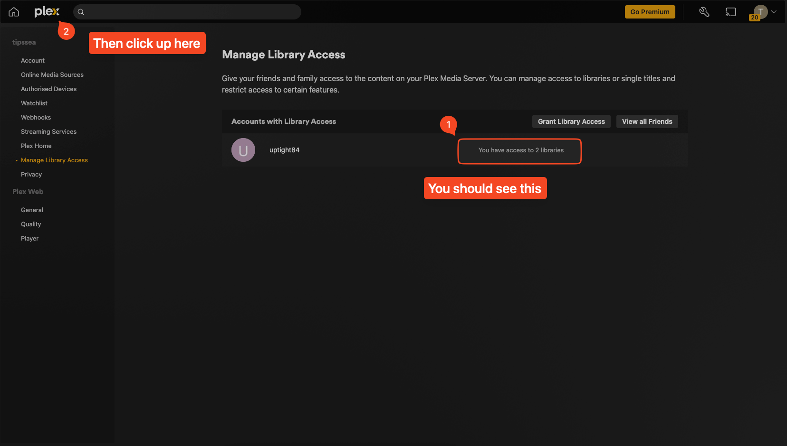
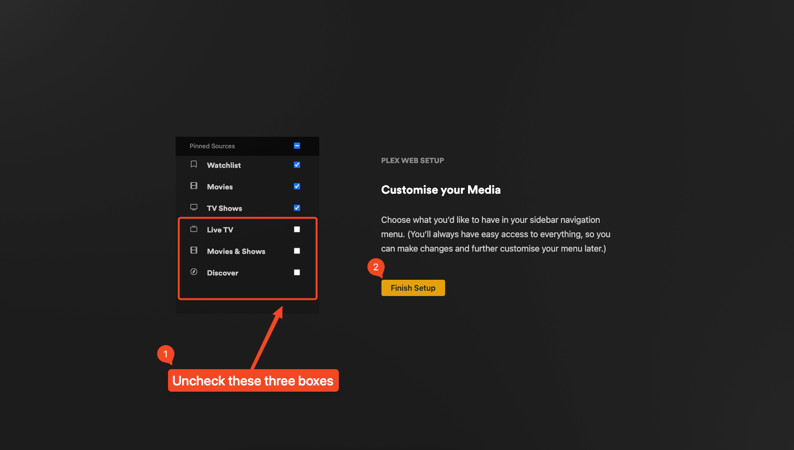
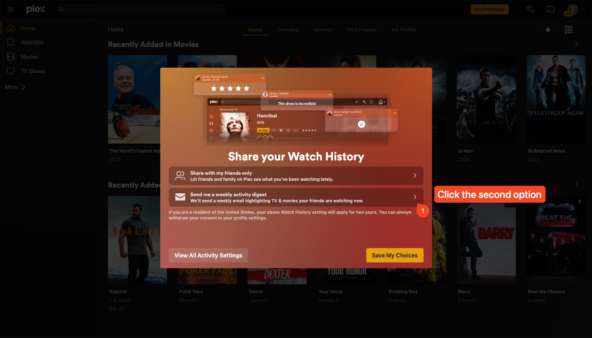
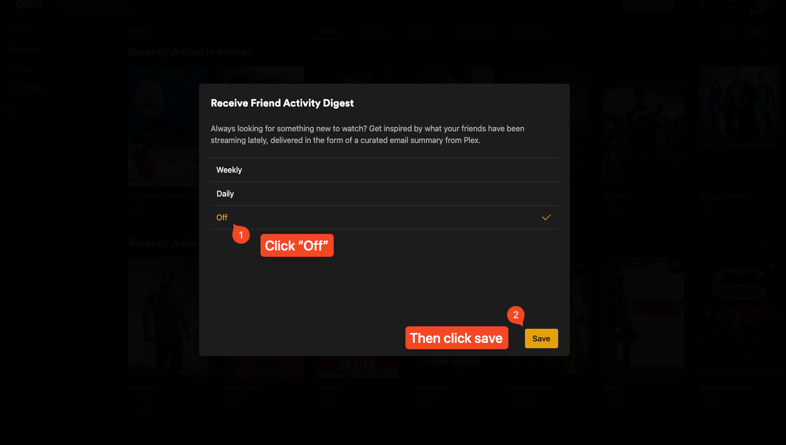
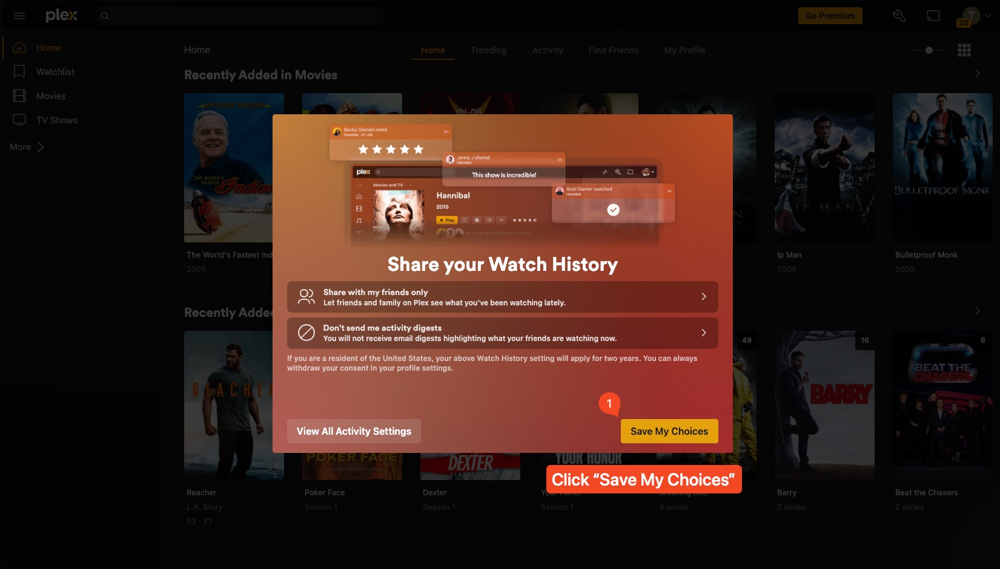
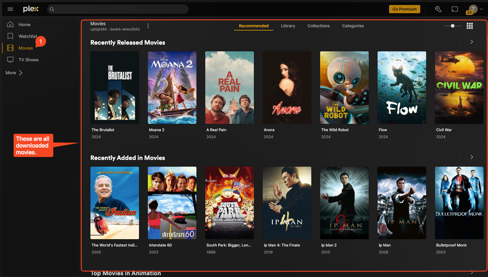
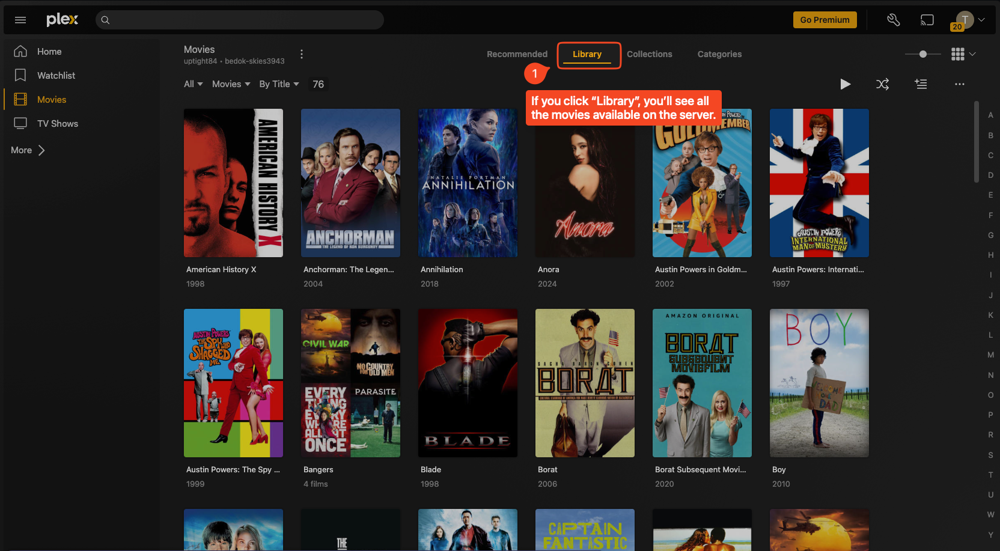
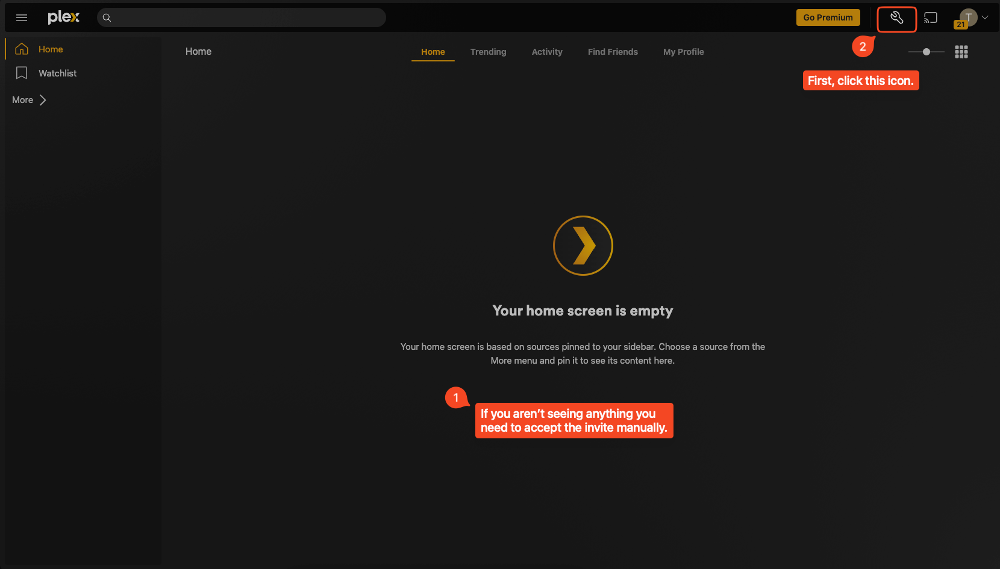
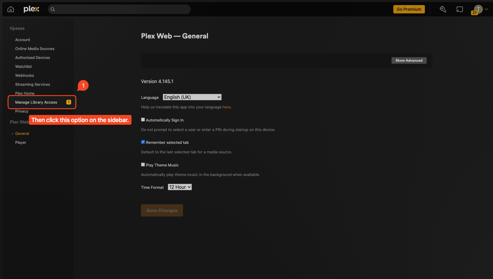
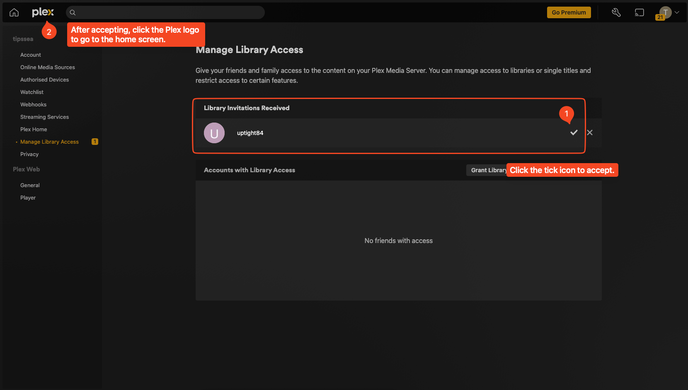

# Welcome to My Plex Server!

This guide will walk you through the process of joining my Plex server and
optimizing your settings for the best experience.

## Step 1: Create a Plex Account

1. Visit [Plex.tv](https://www.plex.tv/) and click "Sign Up"
2. Create an account using your email address
3. **Important:** Send me the email address you used to register so I can send
   you an invitation

## Step 2: Accept the Invitation

1. Check your email for an invitation from Plex
2. Click the invitation link (it will look something like this:
   https://clients.plex.tv/servers/shared\_servers/accept?invite\_token=...)

## Step 3: Confirm Access

After clicking the invitation link and authorizing, you should see a screen that
shows "Manage Library Access" with your username and a message indicating you
have access to libraries.

_Confirmation screen showing you have access to the server_

This confirms you now have access to my Plex server\! The next steps will help
you configure your settings for the best experience.

## Step 4: Customize Your Media Options

During the initial setup, you'll be prompted to customize your media sidebar. I
recommend unchecking the Plex "bloat" features and only keeping the essentials:

 _Uncheck the highlighted options_

### Why remove these options?

- **Live TV**: Unless you're using Plex for live television (which my server
  doesn't provide), this is unnecessary.
- **Movies & Shows**: This refers to Plex's own streaming content, which is
  often low-quality and will just clutter your library with content that isn't
  from my server.
- **Discover**: This primarily promotes Plex's own content and subscription
  services rather than the media I'm sharing with you.

Keep "Watchlist", "Movies", and "TV Shows" checked as these are what you'll
actually use to browse and watch content from my server.

Then click "Finish Setup" to continue.

## Step 5: Disable Email Digests

Next, you'll see a popup about sharing your watch history:

 _Select "Don't send me activity
digests"_

1. Click the second option "Don't send me activity digests" to prevent Plex from
   sending you regular email notifications about what others are watching
2. This will open a digest frequency configuration screen:

 _Select "Off" to disable notifications_

3. Select "Off" to disable these email notifications completely
4. Then click "Save" to confirm your choice

## Step 6: Save All Your Choices

Finally, you'll be returned to the watch history screen. Click "Save My Choices"
to finalize all your settings:

## Using the Plex Interface

### Finding Movies and TV Shows

After setup, you'll see the main interface with content categories in the
sidebar:

 _The movies
interface showing downloaded content_

Click on "Movies" or "TV Shows" in the sidebar to browse available content. All
the movies and shows are downloaded onto my server for reliable streaming.

### Viewing All Available Content

For a complete list of all movies:

1. Click on "Movies" in the sidebar
2. Then click the "Library" tab at the top
3. This gives you a comprehensive alphabetical list of all available movies

## Troubleshooting

### If Your Home Screen Is Empty

If you see an empty home screen like this:

The invitation may not have been properly accepted. You'll need to manually
accept the invitation:

1. Click the notification bell icon in the top right
2. If you can't see content, you'll need to accept the invite manually

### Manually Accepting an Invitation

If you need to manually accept the invitation:

1. Click "Manage Library Access" in the sidebar as shown

Then on the invitation screen:

1. Look for my username under "Library Invitations Received"
2. Click the tick icon to accept the invitation
3. After accepting, click the Plex logo to go to the home screen

## Tips for a Better Experience

- **Use the Plex app**: For the best playback experience, download the Plex app
  for your device (smartphone, tablet, smart TV, or streaming device)
- **Add to Watchlist**: Click the bookmark icon on any movie or show to add it
  to your Watchlist for easy access later
- **Set video quality**: If you experience buffering, try adjusting the video
  quality settings in the player

If you have any questions or issues, please let me know\!
