# Using Jellyseerr to Request Content

Jellyseerr is a content request system that allows you to easily request movies
and TV shows that aren't currently on the Plex server. This guide will walk you
through how to set it up and use it.

## Setting Up Jellyseerr on Your Mobile Device

The easiest way to use Jellyseerr is to add it to your home screen as a web app
(PWA - Progressive Web App). This allows you to access it just like any other
app on your device.

### Step 1: Visit the Jellyseerr Website

Visit the Jellyseerr website at: https://jellyseerr-skies3943.bedok.usbx.me/

You'll see the Jellyseerr login screen:

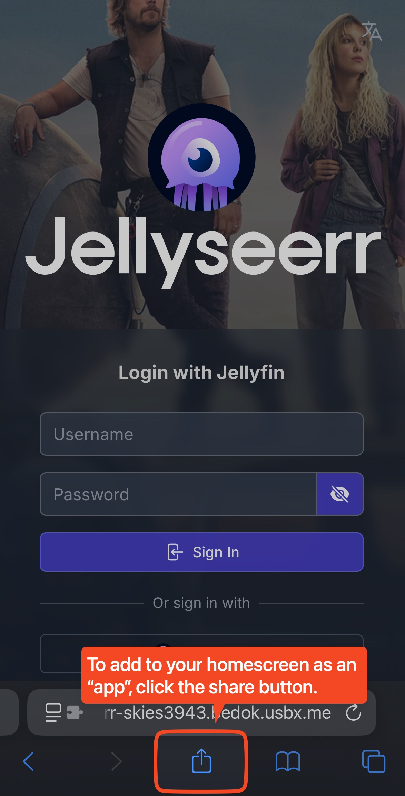

### Step 2: Add to Home Screen

To add Jellyseerr to your home screen:

1. **Share the page**: Click the share button (square with arrow) at the bottom
   of your Safari browser

   _Android (Chrome) users: Tap the three dots (⋮) in the top-right corner of
   Chrome_

2. **Select "Add to Home Screen"**: Scroll down in the share menu and tap on
   "Add to Home Screen"

   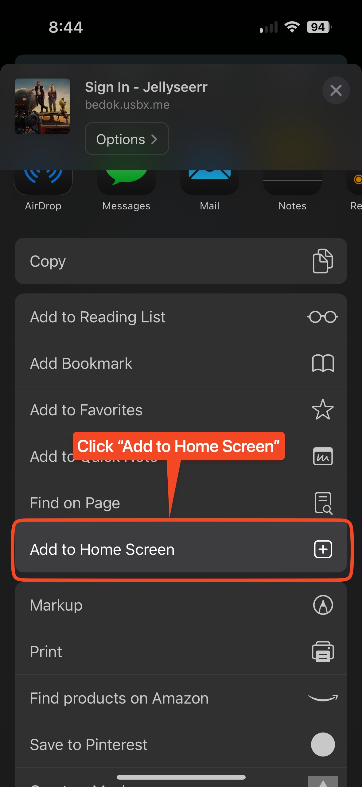

3. **Name the app**: You can keep the default name "Jellyseerr" or change it if
   you prefer

   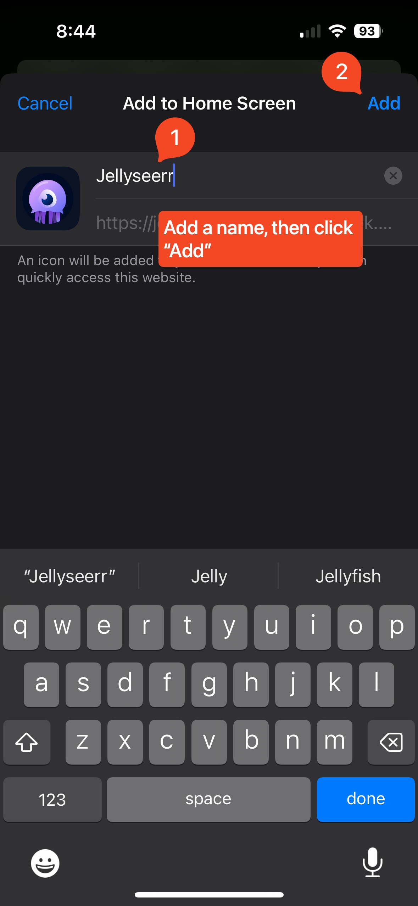

4. **Tap "Add"** to confirm and add the icon to your home screen

### Step 3: Access Jellyseerr from Your Home Screen

Now you'll have the Jellyseerr icon on your home screen for easy access:

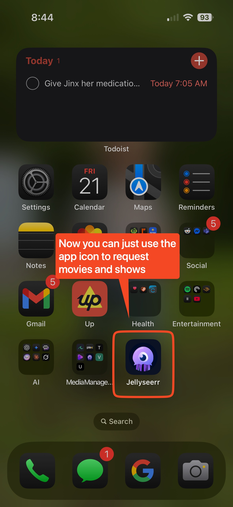

**Note:** The first time you open the app from your home screen, you may be
prompted to allow notifications. Please select "Allow" so you'll be notified
when your requested movies and shows become available.

## Using Jellyseerr to Request Content

### Step 1: Login to Jellyseerr

When you first open Jellyseerr, you'll need to log in with your credentials:

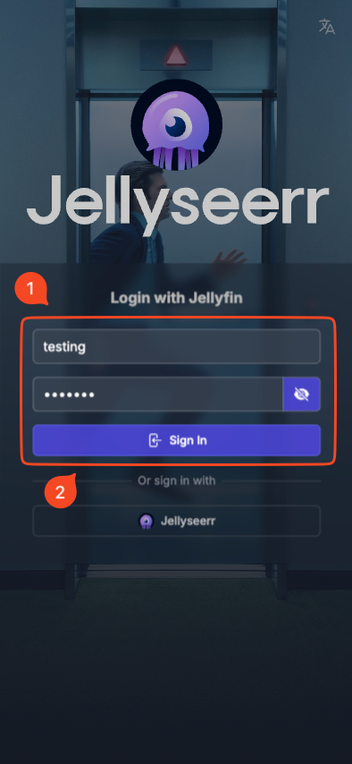

1. Enter your username
2. Enter your password
3. Click "Sign In"

### Step 2: Search for Content

Once logged in, you'll see the home screen with trending and popular content:

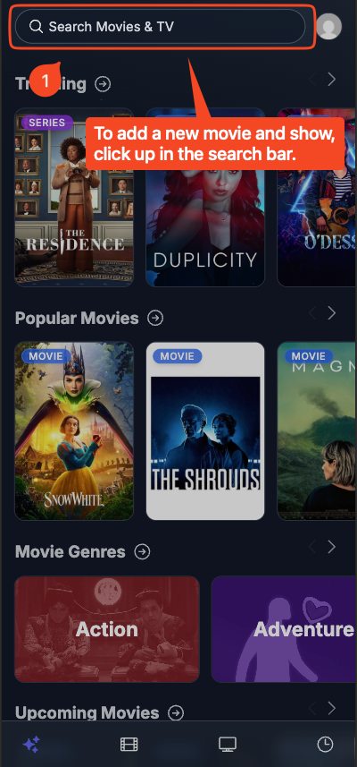

To find specific content, click the search bar at the top and enter the title of
the movie or TV show you want to request.

### Step 3: Select the Content

After searching, you'll see the results matching your query:

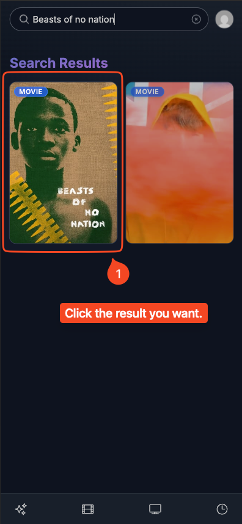

Click on the title you're interested in to open its details page.

### Step 4: Request the Content

On the details page, you'll see information about the movie or show:

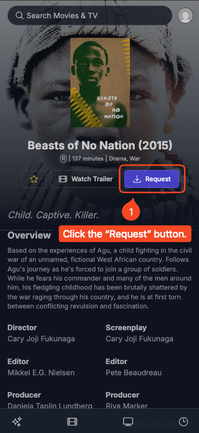

Click the blue "Request" button to request the content.

### Step 5: Confirm Your Request

A confirmation dialog will appear:

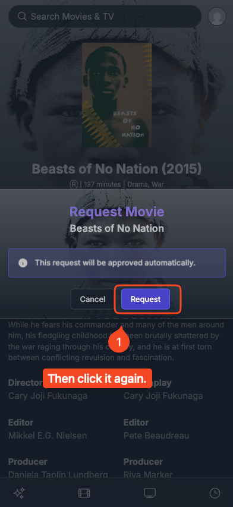

Click "Request" again to confirm your request.

The system will now automatically approve your request, and the system will
start to download the content for you.

### Checking the Status of Your Requests

After requesting content, you can track its status from request to availability:

#### Step 1: Check Your Recent Requests

After submitting your request, click the sparkle icon at the bottom of the
screen to return to the home page:

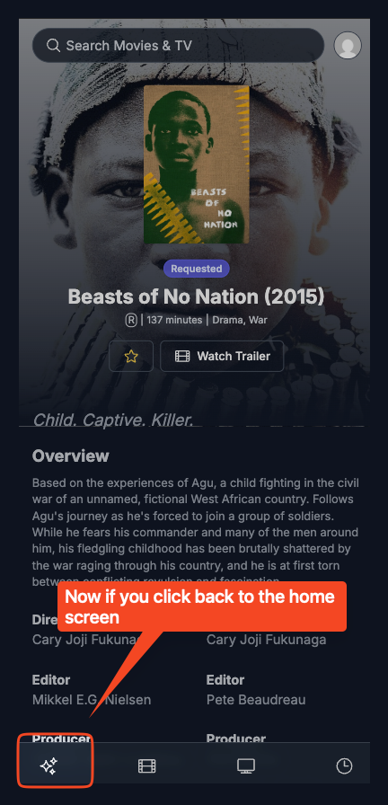

#### Step 2: View Request Status

On the home screen, you'll see a "Recent Requests" section that shows all your
requested content:

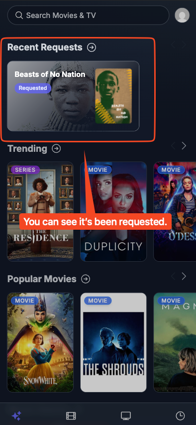

Your request will initially show a blue "Requested" tag, indicating it's been
submitted and is being processed.

#### Step 3: Wait for Content to Be Available

After processing (which usually takes around 5-10 minutes), the status will
change to "Available":

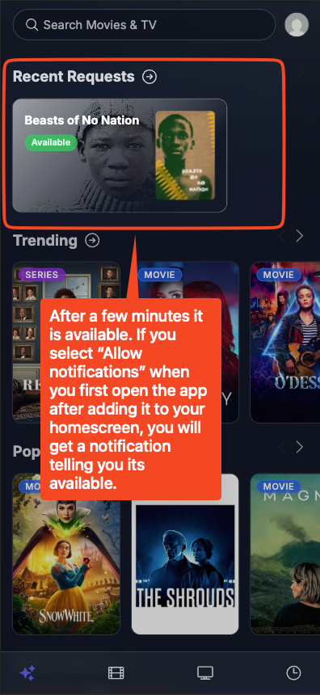

**Note:** If you allowed notifications when first using the app, you'll receive
a notification when your request becomes available for watching.

#### Step 4: Watch Your Content on Plex

Once your request shows as "Available", you can open Plex to enjoy your content:

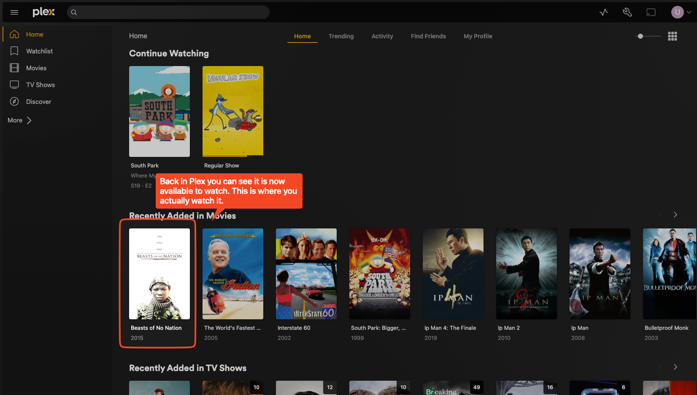

The requested movie or show will appear in the "Recently Added" section in Plex,
ready for you to watch.

## Managing Your Requests

You can view all your current and past requests by clicking on "Requests" in the
navigation menu of Jellyseerr. From there, you can:

- See which requests are pending
- Check which content is already available
- Cancel requests if needed

## Tips for Using Jellyseerr

- **Browse Popular Content**: The home page shows trending and popular movies
  and TV shows
- **Check Release Dates**: For new movies, check when they'll be available for
  home release
- **Request Full Seasons**: For TV shows, you can request entire seasons,
  although please only request the season you intend to watch as requesting the
  entire show will download every season.
- **Search Carefully**: Make sure to select the correct version of the movie or
  show you want

If you have any questions or issues with Jellyseerr, please let me know!
